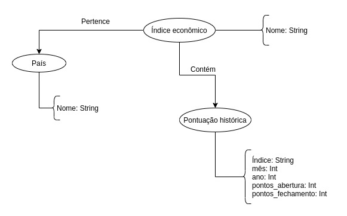

# Aluno
- 241882: Matheus Silva de Deus

# Modelo Lógico do Banco de Dados de Grafos

> 

# Perguntas de Pesquisa/análise

- É possível notar a formação de clusters utilizando os valores de pontuações históricas dos índices, em determinado período de tempo?

- Como países mais pobres se relacionam, a partir da flutuação  das pontuações históricas de seus índices econômicos em determinado período de tempo?

- Como a economia de países se relacionam com altas/baixas flutuações de seus índices econômicos em determinado período de tempo?