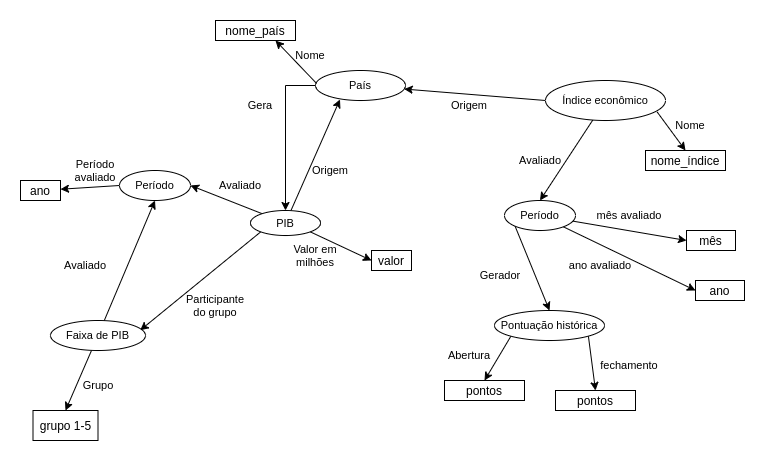

# Aluno
- 241882: Matheus Silva de Deus

# Grafo de conhecimento

> 

# Possíveis perguntas 

- Selecionando-se o índice econômico BOVESPA, qual foi o PIB gerado pelo país ao qual tal índice pertence, no ano de 2018?

- Quantos pontos de fechamento o índice econômico S&P 500 conseguiu alcançar em abril de 2019?

- A qual faixa de PIB o Brasil pertencia no ano de 2016?